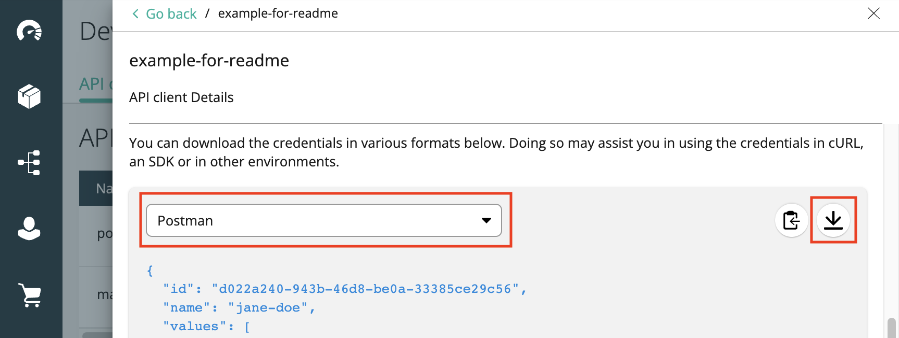

# Getting started with the commercetools Postman collection

Postman is an API platform that helps you quickly use REST APIs without any development effort.
The API requests are managed within a **collection** that you can import into Postman.

This repository contains Postman collections including requests, responses as well as most commercetools endpoints and commands.
For each command, the smallest possible payload is given. Optional fields can be found in the related [official documentation](http://docs.commercetools.com/).

Additionally, the collection provides example requests and responses for specific tasks and more complex data models.

## Disclaimer

This is not the official commercetools documentation. Please see [here](http://docs.commercetools.com/) for a complete and approved documentation.

## Available Postman collections

- [Platform API](api/)
- [Import](import/)
- [Machine Learning](ml/)

**:warning: Use these collection only for development purposes and non-production projects.**

Feel free to clone the collection and adjust it to your needs.

## Install Postman App

Instructions for installing the Postman app or using the web version can be found at https://www.postman.com/downloads/.

## Import commercetools Postman collection

Every root folder in [Platform API](api/), [Import](import/) and [Machine Learning](ml/) contains a `collection.json` file.
You can import these files into Postman, for details see [Importing data into Postman](https://learning.postman.com/docs/getting-started/importing-and-exporting-data/#importing-data-into-postman) in the Postman documentation.

After the import, you should be able to see the collection. If you expand the collection, there are two primary folders:

- **Authorization** - Use "Obtain access token" to get an authentication token. This is required for using the endpoints in the **Project** folder.
- **Project** - Ready to use, explore the endpoints.

## Setting up an environment via commercetools API client

An environment is a set of variables that you can use in your Postman queries. It can be generated and downloaded from the Merchant Center using the API Client to match your project:

1. Create an API client following the instructions provided in [Create an API Client](https://docs.commercetools.com/merchant-center/api-clients#create-an-api-client) in the Merchant Center documentation.
1. After clicking **Create API Client**, scroll down to the credential downloads section.
1. Choose **Postman** from the dropdown menu.
1. Click the **Download** icon.

   
   This will download a Postman environment file containing all relevant data for your project.

1. In Postman, click **File** > **Import** and upload the environment obtained from the Merchant Center.

   The environment can now be chosen from the environment selector at the top-right of Postman.

## Setting up an environment manually

Every root folder in [Platform API](api/), [Import](import/) and [Machine Learning](ml/) contains a `template.json` file.
To set up an environment using these templates, perform the following steps:

1. Import the `template.json` file, see [Importing data into Postman](https://learning.postman.com/docs/getting-started/importing-and-exporting-data/#importing-data-into-postman) in the Postman documentation for details.
   This will create an empty variable set environment.
   

1. Set the initial values for primary variables:

   - host : The host information can be [found here](https://docs.commercetools.com/api/general-concepts#hosts).
   - auth_url : The Authorization URL can be [found here](https://docs.commercetools.com/api/authorization#requesting-an-access-token-using-commercetools-oauth-20-server).
   - client_id : From your API Client. More information can be [found here](https://docs.commercetools.com/merchant-center/api-clients#create-an-api-client).
   - client_secret : From your API Client.
   - project_key: Your project key.

   The environment is now ready to be used.
